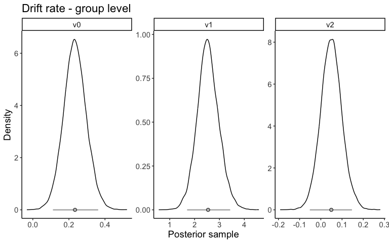
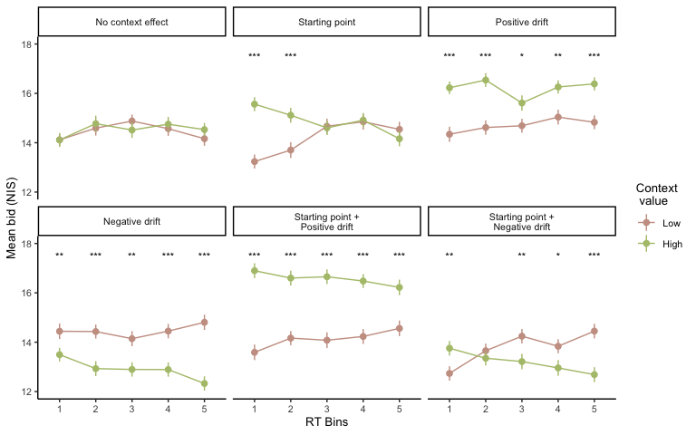

# How context affects choice and valuation of consumer products 

# Summary of project

When we make choices, choice options are often surrounded by other products that serve as a context. Context can affect the choice and valuation of choice options by two different mechanisms. 

* A high-value context might make items appear less attractive or more attractive.
* A high-value context might set prior expectations about the item’s value. 

These two mechanisms can be dissociated by modeling choices and response times using computational models. I used the diffusion decision model (DDM; [Ratcliff & McKoon, 2008](https://direct.mit.edu/neco/article-abstract/20/4/873/7299/The-Diffusion-Decision-Model-Theory-and-Data-for?redirectedFrom=fulltext)) to uncover how context affects the choice and valuation of consumer products. Within the DDM framework, the impact of context before and during the decision/valuation process is captured by the starting point and drift rate, respectively. The starting point primarily affects fast responses, while the drift rate primarily influences slow responses. Thus, if context affects the starting point, context effect would be observed only in fast responses. 

We found a positive effect of context on both choice and valuation. Interestingly, this positive context effect was observed only in the fast responses, indicating a starting point bias. DDM results further support that context effect on the starting point is a key mechanism driving the positive context effect observed in our study. Thus, this study shows that context affects the choice and valuation of items by setting prior expectations for upcoming choices and valuations.

Link to paper: [Izakson, L.1, **Yoo, M.**1, Hakim, A., Krajbich, I., Webb, R., & Levy, D. J. (2024). Valuations of target items are drawn towards unavailable decoy items due to prior expectations. PNAS nexus, 3(7).](https://academic.oup.com/pnasnexus/article/3/7/pgae232/7697877) (1 denotes equal contribution)

# Experiment 

We ran choice and valuation experiments to investigate context effect. 

### Choice 

Participants saw three products on each side of the screen. For the first four seconds, participants were instructed to observe all items on the screen (naïve forced exposure). During this time, they did not know which of the three products on each side would be available for choice. After four seconds, the target product on each side of the screen was highlighted with an orange-colored bounding box. In the Context condition, the remaining context products were highlighted with purple-colored bounding boxes. Participant chose their preferred target product within 1.5 seconds. 

Trial types differed in the value of the products presented as context. The higher-value target and the lower-value target were surrounded by two high-context products and two low-context products, respectively (HhLl), or two low-context products and two high-context products, respectively (HlLh), or all four context products were high value (HhLh) or low value (HlLl). 

### Valuation

Participants saw three products on the screen. For the first four seconds of a trial, participants observed the three products without knowing which one of them would be the target product (naïve forced exposure). After four seconds, one product was highlighted with an orange-colored bounding box, indicating the target product. The other two products were highlighted with purple-colored bounding boxes, indicating the context products. A sliding bar appeared below the images once the target product was revealed. Participants indicated how much they would be willing to pay for the target product between 0 and 30 NIS within 3 seconds.

There were three trial types in the experiment. The target was surrounded by two context products with high-value (High context), low-value (Low context), or medium-value (Medium context).

  

# EDA 

- Context had a positive effect on choice and valuation. 
  - Choice: The target product was more likely to be chosen when it was surrounded by high value products compared to when it was surrounded by low value products. 
  - Valuation: The target product was valuated to be higher when it was surrounded by high value context products.
- Interestingly, the positive effect of context on choice and valuation was observed only in fast responses (First and second RT bins). This is an indication of **starting point bias**.  

  
   

- For detailed EDA report, refer to this page: 
  - [Experiment 1: Choice](eda/eda_exp1_choice.md)
  - [Experiment 2: Valuation](eda/eda_exp2_valuation.md)

# Computational modeling

The DDM assumes that the process of choosing between two options is based on accumulating evidence for one option relative to the other option. A decision is made once the accumulated evidence reaches one of the two decision boundaries. Choices and RT are determined by where the evidence starts to accumulate (starting point $z$) and how fast the evidence accumulates (drift rate $v$). 

I used the DDM and a WTP (willingness to pay) accumulation model, a variant of DDM for responses on a continuous scale, to investigate how context influences the choice and valuation of items. Both models aim to explain choice/valuation and response times simultaneously. In more general terms, the DDM is a parametric model that simultaneously solves binary classification and linear regression, whereas the WTP accumulation model is a linear regression model for two outcome variables.

  

### Choice

- I built six models representing psychological hypotheses:
  - Three hypotheses on the context effect on the starting point (Baseline, Target-only, Context) 
  - Two hypotheses on the context effect on the drift rate (Target-only, Context)
  - Considered all combinations of context effects on the starting point and the drift rate, resulting in six models.
- I fitted six models by a hierarchical Bayesian approach in python using [HDDM package](https://hddm.readthedocs.io/en/latest/). 
- The performance of six models was compared by Bayesian Predictive Information Criterion (BPIC). The model with the lowest BPIC was selected as the best-fitting model. 
- Among the six models considered, the best-fitting model included **context effects on both starting point and drift rate**.

<!-- -->

The group level posterior distribution of the best-fitting model was examined to infer the mechanism of context effects. 

- Context effect on the starting point 
  - The 95% highest density interval (HDI) of the group level $z_1$ posterior distribution was strictly positive. 
  - A positive $z_1$ indicates that the starting point was shifted towards the side with the higher overall value of the set of three items. This shift suggests participants favored choosing the target product surrounded by higher-valued context items.
- Context effect on the drift rate 
  - The value of the target products was the main determinant of drift rate. 
    - The 95% HDI of the group level $v_1$ posterior distribution (the effect of the target value difference) was strictly positive. 
  - Context had a more variable effect on drift rate. 
    - The 95% HDI of the group level $v_2$ posterior distribution (the effect of the overall value of the context products across all trial types) was not strictly positive or negative. The probability of $v_2$ above zero was 0.85. 
    - Also, the direction of context effect varied among participants, with a mean probability of 0.57 for $v_2$ being above zero.
  - Overall, these findings suggest that context had a differential impact on the evidence accumulation process for each participant, although the aggregate effect on drift rate was positive.

  
   

### Valuation

- I constructed six variations of the WTP accumulation model to explore psychological hypotheses:
  - Two hypotheses focused on the context effect on the starting point (Baseline, Context).
  - Three hypotheses examined the context effect on the drift rate (Target-only, Positive context, Negative context).
  - All combinations of context effects on the starting point and drift rate were considered, resulting in six distinct models.
- Each model was simulated to generate bids (willingness to pay) and response time data.
- I assessed which of the six models best mimicked the observed data.

Among the models considered, only **the starting point bias model without a context effect on the drift rate** showed the observed relationship between bids and response time. This model exhibited a positive context effect only in fast responses.

<!-- -->

- For details of computational models, refer to this page:
  - [Diffusion model for choice experiment](/model/binaryDDM/exp1_DDM_results.md)
  - [Diffusion model for valuation experiment](/model/continuousDDM/exp2_DDM_results.md) 

