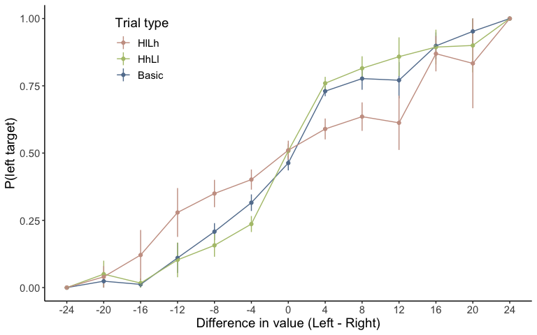
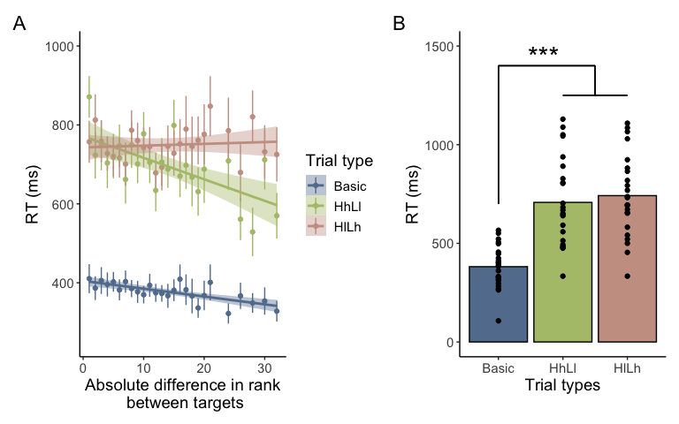
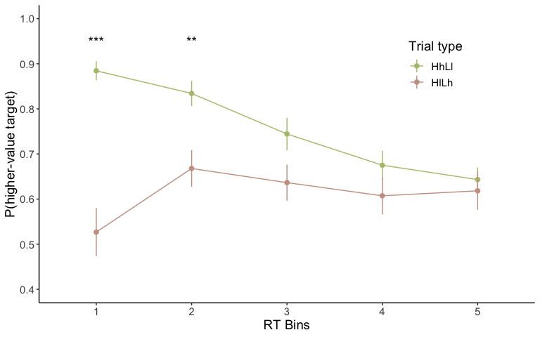

EDA: Experiment 1 - Choice
================

# Positive effect of context on choice

-   Two mixed effect logistic regression were ran to test the effect of context on
    choice.
-   Results
    -   The target product was more likely to be chosen when it was
        surrounded by high value products (HhLl trial type, green line
        Figure 1) compared to when it was surrounded by low
        value products (HlLh trial type, red line Figure 1).
    -   As the mean value of context product increased, the target was
        more likely to be chosen.



-   Details on statistical analysis
    -   Mixed effect model: a logistic regression with a random
        intercept
        -   Choice \~ absolute value difference between target
            products + trial type

``` r
t1 = glmer(Correct ~ absVD + TrialType + (1 | Subject),
           data = data_reg, family = binomial)
```

<table>
<thead>
<tr>
<th style="text-align:left;">
</th>
<th style="text-align:right;">
Estimate
</th>
<th style="text-align:right;">
Std. Error
</th>
<th style="text-align:right;">
z value
</th>
<th style="text-align:right;">
Pr(&gt;\|z\|)
</th>
</tr>
</thead>
<tbody>
<tr>
<td style="text-align:left;">
(Intercept)
</td>
<td style="text-align:right;">
0.318
</td>
<td style="text-align:right;">
0.095
</td>
<td style="text-align:right;">
3.347
</td>
<td style="text-align:right;">
0.001
</td>
</tr>
<tr>
<td style="text-align:left;">
absVD
</td>
<td style="text-align:right;">
0.139
</td>
<td style="text-align:right;">
0.008
</td>
<td style="text-align:right;">
16.734
</td>
<td style="text-align:right;">
0.000
</td>
</tr>
<tr>
<td style="text-align:left;">
TrialTypeHh
</td>
<td style="text-align:right;">
0.219
</td>
<td style="text-align:right;">
0.077
</td>
<td style="text-align:right;">
2.830
</td>
<td style="text-align:right;">
0.005
</td>
</tr>
<tr>
<td style="text-align:left;">
TrialTypeHl
</td>
<td style="text-align:right;">
-0.536
</td>
<td style="text-align:right;">
0.072
</td>
<td style="text-align:right;">
-7.486
</td>
<td style="text-align:right;">
0.000
</td>
</tr>
<tr>
<td style="text-align:left;">
TrialTypehh
</td>
<td style="text-align:right;">
-0.012
</td>
<td style="text-align:right;">
0.098
</td>
<td style="text-align:right;">
-0.123
</td>
<td style="text-align:right;">
0.902
</td>
</tr>
<tr>
<td style="text-align:left;">
TrialTypell
</td>
<td style="text-align:right;">
-0.011
</td>
<td style="text-align:right;">
0.098
</td>
<td style="text-align:right;">
-0.115
</td>
<td style="text-align:right;">
0.909
</td>
</tr>
</tbody>
</table>

-   Details on statistical analysis
    -   Mixed effect model: a logistic regression with a random
        intercept
        -   Choice \~ absolute value difference between target
            products + the mean value of context products surrounding
            higher-value target + the mean value of context products
            surrounding lower-value target

``` r
t2 = glmer(Correct ~ absVD + highTargetCV + lowTargetCV + (1 | Subject),
             data = data_reg, family = binomial)
```

<table>
<thead>
<tr>
<th style="text-align:left;">
</th>
<th style="text-align:right;">
Estimate
</th>
<th style="text-align:right;">
Std. Error
</th>
<th style="text-align:right;">
z value
</th>
<th style="text-align:right;">
Pr(&gt;\|z\|)
</th>
</tr>
</thead>
<tbody>
<tr>
<td style="text-align:left;">
(Intercept)
</td>
<td style="text-align:right;">
0.275
</td>
<td style="text-align:right;">
0.117
</td>
<td style="text-align:right;">
2.359
</td>
<td style="text-align:right;">
0.018
</td>
</tr>
<tr>
<td style="text-align:left;">
absVD
</td>
<td style="text-align:right;">
0.127
</td>
<td style="text-align:right;">
0.010
</td>
<td style="text-align:right;">
12.243
</td>
<td style="text-align:right;">
0.000
</td>
</tr>
<tr>
<td style="text-align:left;">
highTargetCV
</td>
<td style="text-align:right;">
0.015
</td>
<td style="text-align:right;">
0.003
</td>
<td style="text-align:right;">
5.073
</td>
<td style="text-align:right;">
0.000
</td>
</tr>
<tr>
<td style="text-align:left;">
lowTargetCV
</td>
<td style="text-align:right;">
-0.016
</td>
<td style="text-align:right;">
0.003
</td>
<td style="text-align:right;">
-5.342
</td>
<td style="text-align:right;">
0.000
</td>
</tr>
</tbody>
</table>

# The effect of context on response time (RT)

-   A mixed effect linear regression was run on response time (RT) to assess the
    effect of context on response time.
-   Results
    -   RT in Basic trials (choice without context products) was faster
        than RT in Context trials (choice with context products)
        (Figure 2B).
    -   RT was faster when the value difference between target products
        was larger (Basic trial type, blue line on Figure 2A).
    -   The decrease in RT as a function of target value difference was
        larger when the higher value target was surrounded by high value
        context products (HhLl trial type, green line on Figure 2A). And the
        negative effect of target value difference was smaller when the
        higher value target was surrounded by low value context products
        (HlLh trial type, red line on Figure 2A).

<!-- -->



-   Details on statistical analysis
    -   Mixed effect model: a linear regression with a random intercept
        -   Response time \~ absolute value difference between target
            products \* trial type
        -   Response time was log-transformed because the RT
            distribution was right-skewed.

``` r
t3 = lmer(log(RT_sec) ~ absVD*TrialType + (1 | Subject),
            data = data_reg %>% filter(RT_sec > 0.1)) 
```

<table>
<thead>
<tr>
<th style="text-align:left;">
</th>
<th style="text-align:right;">
Estimate
</th>
<th style="text-align:right;">
Std. Error
</th>
<th style="text-align:right;">
df
</th>
<th style="text-align:right;">
t value
</th>
<th style="text-align:right;">
Pr(&gt;\|t\|)
</th>
</tr>
</thead>
<tbody>
<tr>
<td style="text-align:left;">
(Intercept)
</td>
<td style="text-align:right;">
-0.973
</td>
<td style="text-align:right;">
0.049
</td>
<td style="text-align:right;">
25.969
</td>
<td style="text-align:right;">
-19.738
</td>
<td style="text-align:right;">
0.000
</td>
</tr>
<tr>
<td style="text-align:left;">
absVD
</td>
<td style="text-align:right;">
-0.008
</td>
<td style="text-align:right;">
0.002
</td>
<td style="text-align:right;">
6827.687
</td>
<td style="text-align:right;">
-4.127
</td>
<td style="text-align:right;">
0.000
</td>
</tr>
<tr>
<td style="text-align:left;">
TrialTypeHh
</td>
<td style="text-align:right;">
0.576
</td>
<td style="text-align:right;">
0.022
</td>
<td style="text-align:right;">
6816.283
</td>
<td style="text-align:right;">
26.187
</td>
<td style="text-align:right;">
0.000
</td>
</tr>
<tr>
<td style="text-align:left;">
TrialTypeHl
</td>
<td style="text-align:right;">
0.550
</td>
<td style="text-align:right;">
0.022
</td>
<td style="text-align:right;">
6816.369
</td>
<td style="text-align:right;">
24.923
</td>
<td style="text-align:right;">
0.000
</td>
</tr>
<tr>
<td style="text-align:left;">
TrialTypehh
</td>
<td style="text-align:right;">
0.644
</td>
<td style="text-align:right;">
0.029
</td>
<td style="text-align:right;">
6816.193
</td>
<td style="text-align:right;">
22.262
</td>
<td style="text-align:right;">
0.000
</td>
</tr>
<tr>
<td style="text-align:left;">
TrialTypell
</td>
<td style="text-align:right;">
0.551
</td>
<td style="text-align:right;">
0.029
</td>
<td style="text-align:right;">
6816.183
</td>
<td style="text-align:right;">
18.900
</td>
<td style="text-align:right;">
0.000
</td>
</tr>
<tr>
<td style="text-align:left;">
absVD:TrialTypeHh
</td>
<td style="text-align:right;">
-0.008
</td>
<td style="text-align:right;">
0.003
</td>
<td style="text-align:right;">
6816.023
</td>
<td style="text-align:right;">
-2.328
</td>
<td style="text-align:right;">
0.020
</td>
</tr>
<tr>
<td style="text-align:left;">
absVD:TrialTypeHl
</td>
<td style="text-align:right;">
0.011
</td>
<td style="text-align:right;">
0.003
</td>
<td style="text-align:right;">
6816.045
</td>
<td style="text-align:right;">
3.526
</td>
<td style="text-align:right;">
0.000
</td>
</tr>
<tr>
<td style="text-align:left;">
absVD:TrialTypehh
</td>
<td style="text-align:right;">
0.007
</td>
<td style="text-align:right;">
0.004
</td>
<td style="text-align:right;">
6816.028
</td>
<td style="text-align:right;">
1.611
</td>
<td style="text-align:right;">
0.107
</td>
</tr>
<tr>
<td style="text-align:left;">
absVD:TrialTypell
</td>
<td style="text-align:right;">
0.004
</td>
<td style="text-align:right;">
0.004
</td>
<td style="text-align:right;">
6816.036
</td>
<td style="text-align:right;">
0.881
</td>
<td style="text-align:right;">
0.379
</td>
</tr>
</tbody>
</table>

# Choice - Response time relationship

-   The choice probability was plotted as a function of response time to
    test starting point bias hypothesis.
-   Result
    -   The positive context effect on choice was observed in fast
        responses (first and second RT bin in Figure 3).



-   Details on statistical analysis
    -   Compared the probability of choosing the higher-value target at
        each RT bin with paired t-tests.
    -   RT bin was defined by quantiles (0.2, 0.4, 0.6, 0.8) of each
        trial type’s RT. For example, the first bin included all
        decisions faster than the 0.2 quantile of RT of a trial type,
        the second bin contained decisions faster than the 0.4 quantile
        and slower than the 0.2 quantile of RT of the trial type, etc.

<table>
<caption>
Choice - RT relationship (paired t-tests)
</caption>
<thead>
<tr>
<th style="text-align:left;">
rtBin
</th>
<th style="text-align:right;">
statistic
</th>
<th style="text-align:right;">
p
</th>
</tr>
</thead>
<tbody>
<tr>
<td style="text-align:left;">
1
</td>
<td style="text-align:right;">
5.301
</td>
<td style="text-align:right;">
0.000
</td>
</tr>
<tr>
<td style="text-align:left;">
2
</td>
<td style="text-align:right;">
3.199
</td>
<td style="text-align:right;">
0.004
</td>
</tr>
<tr>
<td style="text-align:left;">
3
</td>
<td style="text-align:right;">
1.902
</td>
<td style="text-align:right;">
0.070
</td>
</tr>
<tr>
<td style="text-align:left;">
4
</td>
<td style="text-align:right;">
1.281
</td>
<td style="text-align:right;">
0.213
</td>
</tr>
<tr>
<td style="text-align:left;">
5
</td>
<td style="text-align:right;">
0.513
</td>
<td style="text-align:right;">
0.613
</td>
</tr>
</tbody>
</table>
