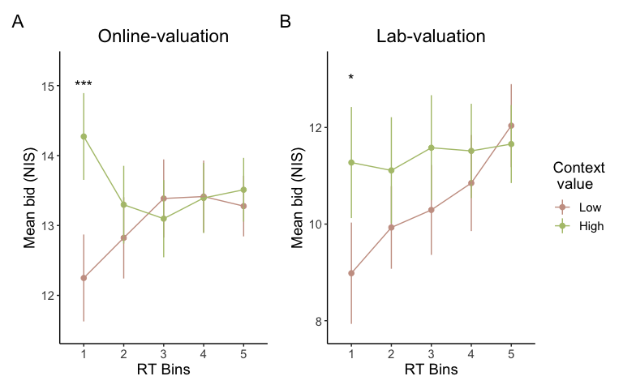

EDA: Experiment 2 - Valuation
================

# Positive effect of context on valuation

-   A mixed-effect linear regression was ran to test the effect of
    context on valuation.
-   Result
    -   Willingness-to-pay (WTP) for a target product increased when the
        target product was surrounded by high value context products
        (Figure 1).
    -   Note) Willingness-to-pay: measure of subjective value for
        consumer products


-   Details on statistical analysis
    -   Mixed effect model: a linear regression with a random intercept
        -   WTP with context products \~ WTP without context products +
            the mean WTP of context products
    -   Online sample

``` r
t10_online = lmer(SlideValue ~ OldValue + cMean + (1 | subjectUniqID), 
                  data = data_reg %>% filter(Exp == "Online"))
```

<table>
<thead>
<tr>
<th style="text-align:left;">
</th>
<th style="text-align:right;">
Estimate
</th>
<th style="text-align:right;">
Std. Error
</th>
<th style="text-align:right;">
df
</th>
<th style="text-align:right;">
t value
</th>
<th style="text-align:right;">
Pr(&gt;|t|)
</th>
</tr>
</thead>
<tbody>
<tr>
<td style="text-align:left;">
(Intercept)
</td>
<td style="text-align:right;">
0.317
</td>
<td style="text-align:right;">
0.218
</td>
<td style="text-align:right;">
246.020
</td>
<td style="text-align:right;">
1.456
</td>
<td style="text-align:right;">
0.147
</td>
</tr>
<tr>
<td style="text-align:left;">
OldValue
</td>
<td style="text-align:right;">
0.926
</td>
<td style="text-align:right;">
0.009
</td>
<td style="text-align:right;">
8332.798
</td>
<td style="text-align:right;">
101.844
</td>
<td style="text-align:right;">
0.000
</td>
</tr>
<tr>
<td style="text-align:left;">
cMean
</td>
<td style="text-align:right;">
0.023
</td>
<td style="text-align:right;">
0.004
</td>
<td style="text-align:right;">
11797.798
</td>
<td style="text-align:right;">
5.482
</td>
<td style="text-align:right;">
0.000
</td>
</tr>
</tbody>
</table>

-   Lab sample

``` r
t10_lab = lmer(SlideValue ~ OldValue + cMean + (1 | subjectUniqID), 
               data = data_reg %>% filter(Exp == "Lab"))
```

<table>
<thead>
<tr>
<th style="text-align:left;">
</th>
<th style="text-align:right;">
Estimate
</th>
<th style="text-align:right;">
Std. Error
</th>
<th style="text-align:right;">
df
</th>
<th style="text-align:right;">
t value
</th>
<th style="text-align:right;">
Pr(&gt;\|t\|)
</th>
</tr>
</thead>
<tbody>
<tr>
<td style="text-align:left;">
(Intercept)
</td>
<td style="text-align:right;">
1.596
</td>
<td style="text-align:right;">
0.459
</td>
<td style="text-align:right;">
47.009
</td>
<td style="text-align:right;">
3.479
</td>
<td style="text-align:right;">
0.001
</td>
</tr>
<tr>
<td style="text-align:left;">
OldValue
</td>
<td style="text-align:right;">
0.827
</td>
<td style="text-align:right;">
0.019
</td>
<td style="text-align:right;">
2931.133
</td>
<td style="text-align:right;">
42.710
</td>
<td style="text-align:right;">
0.000
</td>
</tr>
<tr>
<td style="text-align:left;">
cMean
</td>
<td style="text-align:right;">
0.039
</td>
<td style="text-align:right;">
0.008
</td>
<td style="text-align:right;">
3289.755
</td>
<td style="text-align:right;">
4.655
</td>
<td style="text-align:right;">
0.000
</td>
</tr>
</tbody>
</table>

# The context effects on valuation response time

-   A mixed effect linear regression was run to test the effect of
    context on response time.
-   Results
    -   RT was faster when the value of target product was similar to
        the average value of context products (only in online
        participants).


-   Details on statistical analysis
    -   Mixed effect model: a linear regression with a random intercept
        -   Response time \~ absolute difference between the value of
            the target product and the mean value of context products
        -   Response time was log-transformed because the RT
            distribution was right-skewed.
-   Online sample

``` r
t11_online = lmer(RT_sec ~ abs(cMean_target) + (1|subjectUniqID), 
                  data = data_reg %>% filter(Exp == "Online"))
```

<table>
<thead>
<tr>
<th style="text-align:left;">
</th>
<th style="text-align:right;">
Estimate
</th>
<th style="text-align:right;">
Std. Error
</th>
<th style="text-align:right;">
df
</th>
<th style="text-align:right;">
t value
</th>
<th style="text-align:right;">
Pr(&gt;\|t\|)
</th>
</tr>
</thead>
<tbody>
<tr>
<td style="text-align:left;">
(Intercept)
</td>
<td style="text-align:right;">
1.664
</td>
<td style="text-align:right;">
0.025
</td>
<td style="text-align:right;">
111.536
</td>
<td style="text-align:right;">
67.522
</td>
<td style="text-align:right;">
0.000
</td>
</tr>
<tr>
<td style="text-align:left;">
abs(cMean\_target)
</td>
<td style="text-align:right;">
0.002
</td>
<td style="text-align:right;">
0.001
</td>
<td style="text-align:right;">
11753.070
</td>
<td style="text-align:right;">
2.805
</td>
<td style="text-align:right;">
0.005
</td>
</tr>
</tbody>
</table>

-   Lab sample

``` r
t11_lab = lmer(RT_sec ~ abs(cMean_target) + (1|subjectUniqID), 
               data = data_reg %>% filter(Exp == "Lab"))
```

<table>
<thead>
<tr>
<th style="text-align:left;">
</th>
<th style="text-align:right;">
Estimate
</th>
<th style="text-align:right;">
Std. Error
</th>
<th style="text-align:right;">
df
</th>
<th style="text-align:right;">
t value
</th>
<th style="text-align:right;">
Pr(&gt;\|t\|)
</th>
</tr>
</thead>
<tbody>
<tr>
<td style="text-align:left;">
(Intercept)
</td>
<td style="text-align:right;">
1.535
</td>
<td style="text-align:right;">
0.061
</td>
<td style="text-align:right;">
28.374
</td>
<td style="text-align:right;">
25.345
</td>
<td style="text-align:right;">
0.000
</td>
</tr>
<tr>
<td style="text-align:left;">
abs(cMean\_target)
</td>
<td style="text-align:right;">
0.001
</td>
<td style="text-align:right;">
0.001
</td>
<td style="text-align:right;">
3283.885
</td>
<td style="text-align:right;">
1.181
</td>
<td style="text-align:right;">
0.238
</td>
</tr>
</tbody>
</table>

# WTP - Response time relationship

-   The mean WTP was plotted as a function of response time (RT) to test
    starting point bias hypothesis.
-   Result
    -   The positive context effect on valuation was observed in fast
        responses (first RT bin in Figure 3).



-   Details on statistical analysis
    -   Compared the mean WTP at each RT bin with paired t-tests.
    -   RT bin was defined by quantiles (0.2, 0.4, 0.6, 0.8) of each
        trial type’s RT. For example, the first bin included all
        decisions faster than the 0.2 quantile of RT of a trial type,
        the second bin contained decisions faster than the 0.4 quantile
        and slower than the 0.2 quantile of RT of the trial type, etc.

<table>
<caption>
WTP - RT relationship (paired t-tests)
</caption>
<thead>
<tr>
<th style="text-align:left;">
Exp
</th>
<th style="text-align:left;">
rtBin
</th>
<th style="text-align:right;">
statistic
</th>
<th style="text-align:right;">
p
</th>
</tr>
</thead>
<tbody>
<tr>
<td style="text-align:left;">
Online
</td>
<td style="text-align:left;">
1
</td>
<td style="text-align:right;">
-4.701
</td>
<td style="text-align:right;">
0.000
</td>
</tr>
<tr>
<td style="text-align:left;">
Online
</td>
<td style="text-align:left;">
2
</td>
<td style="text-align:right;">
-1.630
</td>
<td style="text-align:right;">
0.106
</td>
</tr>
<tr>
<td style="text-align:left;">
Online
</td>
<td style="text-align:left;">
3
</td>
<td style="text-align:right;">
1.052
</td>
<td style="text-align:right;">
0.295
</td>
</tr>
<tr>
<td style="text-align:left;">
Online
</td>
<td style="text-align:left;">
4
</td>
<td style="text-align:right;">
0.075
</td>
<td style="text-align:right;">
0.940
</td>
</tr>
<tr>
<td style="text-align:left;">
Online
</td>
<td style="text-align:left;">
5
</td>
<td style="text-align:right;">
-0.868
</td>
<td style="text-align:right;">
0.387
</td>
</tr>
<tr>
<td style="text-align:left;">
Lab
</td>
<td style="text-align:left;">
1
</td>
<td style="text-align:right;">
-2.381
</td>
<td style="text-align:right;">
0.025
</td>
</tr>
<tr>
<td style="text-align:left;">
Lab
</td>
<td style="text-align:left;">
2
</td>
<td style="text-align:right;">
-1.737
</td>
<td style="text-align:right;">
0.094
</td>
</tr>
<tr>
<td style="text-align:left;">
Lab
</td>
<td style="text-align:left;">
3
</td>
<td style="text-align:right;">
-1.446
</td>
<td style="text-align:right;">
0.160
</td>
</tr>
<tr>
<td style="text-align:left;">
Lab
</td>
<td style="text-align:left;">
4
</td>
<td style="text-align:right;">
-0.984
</td>
<td style="text-align:right;">
0.334
</td>
</tr>
<tr>
<td style="text-align:left;">
Lab
</td>
<td style="text-align:left;">
5
</td>
<td style="text-align:right;">
0.548
</td>
<td style="text-align:right;">
0.588
</td>
</tr>
</tbody>
</table>
