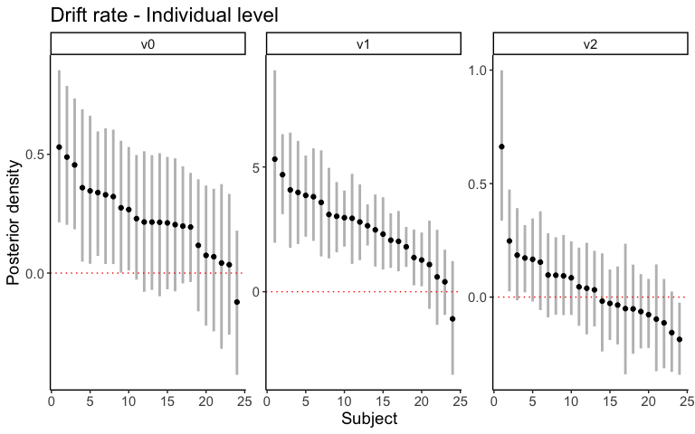

Computational model - Choice
================

# Description of models

1.  Effect of context on starting point

-   Baseline model: No bias in starting point
  
$$
z_i = 0.5
$$

- Target only model: The value of the target products determines the
starting point

$$
z_1 \sim z_0 + z_1 \Delta x_{target,i}
$$

$$
\Delta x_{target,i}  = 
x_{higher-value \ target, \ i} - 
x_{lower-value \ target, \ i}
$$

-   Context model: The value of all products determines the starting
    point. Here, $\Delta x_{side,i}$ represents the
    difference between the summed value of the three products on each
    side of trial. $x_i$ represents the mean bid for the
    product at trial $i$.

$$
z_i \sim z_0 + z_1 \Delta\ x_{side,i}
$$

$$
\Delta x_{side,i}  = 
∑x_{higher-value \ target \ side, \ i} - 
∑x_{lower-value \ target \ side, \ i}
$$

2.  Effect of context on drift rate

-   Target only model: Only the values of the targets determine the
    drift rate. Here, $\Delta x_{target}$ represents the
    value difference between the two target products in trial i.

$$
v_i = v_0 + v_1 \Delta x_{target}
$$

-   Context model: The values of all products determine the drift rate.
    $\Delta x_{context,i}$ represents the difference between the summed value of 
    the two non-target groups of products in the trial.

$$
v_i = v_0 + v_1 \Delta x_{target} + v_2 \Delta x_{context,i} 
$$

3. Models 
-   Constructed six models, considering combinations of context effects
    on starting point and drift rate.
-   Fitted six models to the choice and RT data using HDDM package in
    python.

# Model comparison

-   The performance of six models was compared by Bayesian Predictive
    Information Criterion (BPIC). The model with the lowest BPIC was
    selected as the best model.
-   Among the six models considered, the best-fitting DDM included
    context effects on both starting point and drift rate.

<!-- -->

## Marginal effect of each model component

-   The largest improvement in fit was due to context effects on
    starting point (ΔBPIC = -171.56), though the improvement due to
    context effects on drift was credible (ΔBPIC = -76.07).

<table>
<caption>
Marginal effect of each model component
</caption>
<thead>
<tr>
<th style="text-align:left;">
model
</th>
<th style="text-align:left;">
submodel
</th>
<th style="text-align:right;">
meanBPIC
</th>
<th style="text-align:right;">
deltaBPIC
</th>
</tr>
</thead>
<tbody>
<tr>
<td style="text-align:left;">
Starting point
</td>
<td style="text-align:left;">
Baseline
</td>
<td style="text-align:right;">
6110.75
</td>
<td style="text-align:right;">
0.00
</td>
</tr>
<tr>
<td style="text-align:left;">
Starting point
</td>
<td style="text-align:left;">
Target-only
</td>
<td style="text-align:right;">
6118.48
</td>
<td style="text-align:right;">
7.74
</td>
</tr>
<tr>
<td style="text-align:left;">
Starting point
</td>
<td style="text-align:left;">
Context
</td>
<td style="text-align:right;">
5939.18
</td>
<td style="text-align:right;">
-171.56
</td>
</tr>
<tr>
<td style="text-align:left;">
Drift rate
</td>
<td style="text-align:left;">
Target-only
</td>
<td style="text-align:right;">
6094.17
</td>
<td style="text-align:right;">
0.00
</td>
</tr>
<tr>
<td style="text-align:left;">
Drift rate
</td>
<td style="text-align:left;">
Context
</td>
<td style="text-align:right;">
6018.10
</td>
<td style="text-align:right;">
-76.07
</td>
</tr>
</tbody>
</table>

<!-- -->

# Posterior distributions of the best-fitting model

## Group level posterior distribution

### Starting point

The value of all products determines the starting point.

-   95% highest density interval (HDI)

<table>
<caption>
95% HDI of group level posterior distribution
</caption>
<thead>
<tr>
<th style="text-align:left;">
paramName
</th>
<th style="text-align:right;">
hdi\_low
</th>
<th style="text-align:right;">
hdi\_high
</th>
<th style="text-align:right;">
sampleMean
</th>
</tr>
</thead>
<tbody>
<tr>
<td style="text-align:left;">
z0
</td>
<td style="text-align:right;">
-0.073
</td>
<td style="text-align:right;">
0.027
</td>
<td style="text-align:right;">
-0.023
</td>
</tr>
<tr>
<td style="text-align:left;">
z1
</td>
<td style="text-align:right;">
0.013
</td>
<td style="text-align:right;">
0.052
</td>
<td style="text-align:right;">
0.033
</td>
</tr>
</tbody>
</table>

-   Posterior distribution
    -   Dots and grey bars represent the mean and the 95% HDI.

<!-- -->

<!-- -->

### Drift rate

The values of all products linearly determine the drift rate.

-   95% highest density interval (HDI)

<table>
<caption>
95% HDI of group level posterior distribution
</caption>
<thead>
<tr>
<th style="text-align:left;">
paramName
</th>
<th style="text-align:right;">
hdi\_low
</th>
<th style="text-align:right;">
hdi\_high
</th>
<th style="text-align:right;">
sampleMean
</th>
</tr>
</thead>
<tbody>
<tr>
<td style="text-align:left;">
v0
</td>
<td style="text-align:right;">
0.112
</td>
<td style="text-align:right;">
0.362
</td>
<td style="text-align:right;">
0.234
</td>
</tr>
<tr>
<td style="text-align:left;">
v1
</td>
<td style="text-align:right;">
1.698
</td>
<td style="text-align:right;">
3.432
</td>
<td style="text-align:right;">
2.544
</td>
</tr>
<tr>
<td style="text-align:left;">
v2
</td>
<td style="text-align:right;">
-0.052
</td>
<td style="text-align:right;">
0.147
</td>
<td style="text-align:right;">
0.049
</td>
</tr>
</tbody>
</table>

-   Posterior distribution
    -   Dots and grey bars represent the mean and the 95% HDI.

<!-- -->

## Individual level posterior distributions

### Starting point

-   Y axis: Dots and grey bars represent the mean and the 95% HDI.
-   X axis: Participant index. Participants were sorted by the mean of
    posterior distribution.

<!-- -->

### Drift rate

-   Y axis: Dots and grey bars represent the mean and the 95% HDI.
-   X axis: Participant index. Participants were sorted by the mean of
    posterior distribution.

<!-- -->

# Posterior predictive checks

-   Simulated the best-fitting model 500 times with the samples from the
    posterior distributions to evaluate how well the best-fitting model
    explains the observed data.

## Choice

-   Correlation between observed data and simulated data

<table>
<thead>
<tr>
<th style="text-align:left;">
trialType
</th>
<th style="text-align:right;">
cor
</th>
<th style="text-align:right;">
statistic
</th>
<th style="text-align:right;">
p
</th>
</tr>
</thead>
<tbody>
<tr>
<td style="text-align:left;">
HhLl
</td>
<td style="text-align:right;">
0.94
</td>
<td style="text-align:right;">
12.45
</td>
<td style="text-align:right;">
0.00e+00
</td>
</tr>
<tr>
<td style="text-align:left;">
HlLh
</td>
<td style="text-align:right;">
0.98
</td>
<td style="text-align:right;">
20.95
</td>
<td style="text-align:right;">
0.00e+00
</td>
</tr>
<tr>
<td style="text-align:left;">
HhLh
</td>
<td style="text-align:right;">
0.74
</td>
<td style="text-align:right;">
5.14
</td>
<td style="text-align:right;">
3.76e-05
</td>
</tr>
<tr>
<td style="text-align:left;">
HlLl
</td>
<td style="text-align:right;">
0.85
</td>
<td style="text-align:right;">
7.57
</td>
<td style="text-align:right;">
1.00e-07
</td>
</tr>
</tbody>
</table>

-   Plots of each participant’s observed data (x-axis) versus simulated
    data (y-axis).
    -   The blue dot represents the mean, and the vertical blue bar
        represents the 95% HDI of simulated data. The black diagonal
        line represents the identity line (y = x). The simulated data
        from the best-fitting model aligns well with the observed data,
        showing a successful model fit.

<!-- -->

## Response time distribution

-   Correlation between observed data and simulated data

<table>
<thead>
<tr>
<th style="text-align:right;">
quantile
</th>
<th style="text-align:right;">
cor
</th>
<th style="text-align:right;">
statistic
</th>
<th style="text-align:right;">
p
</th>
</tr>
</thead>
<tbody>
<tr>
<td style="text-align:right;">
0.1
</td>
<td style="text-align:right;">
0.91
</td>
<td style="text-align:right;">
29.82
</td>
<td style="text-align:right;">
0
</td>
</tr>
<tr>
<td style="text-align:right;">
0.3
</td>
<td style="text-align:right;">
0.90
</td>
<td style="text-align:right;">
28.58
</td>
<td style="text-align:right;">
0
</td>
</tr>
<tr>
<td style="text-align:right;">
0.5
</td>
<td style="text-align:right;">
0.87
</td>
<td style="text-align:right;">
24.84
</td>
<td style="text-align:right;">
0
</td>
</tr>
<tr>
<td style="text-align:right;">
0.7
</td>
<td style="text-align:right;">
0.85
</td>
<td style="text-align:right;">
22.39
</td>
<td style="text-align:right;">
0
</td>
</tr>
<tr>
<td style="text-align:right;">
0.9
</td>
<td style="text-align:right;">
0.73
</td>
<td style="text-align:right;">
14.59
</td>
<td style="text-align:right;">
0
</td>
</tr>
</tbody>
</table>

-   Plots of each participant’s observed data (x-axis) versus simulated
    data (y-axis).
    -   The blue dot represents the mean, and the vertical blue bar
        represents the 95% HDI of simulated data. The black diagonal
        line represents the identity line (y = x). The simulated data
        from the best-fitting model aligns well with the observed data,
        showing a successful model fit.

<!-- --><!-- --><!-- --><!-- --><!-- -->
