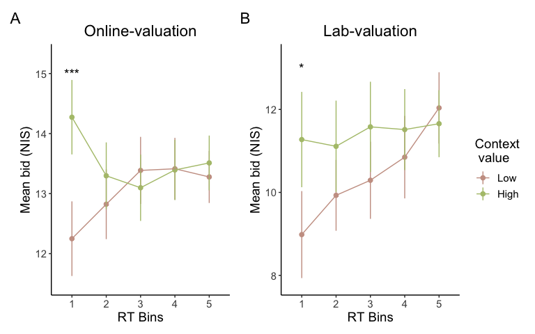
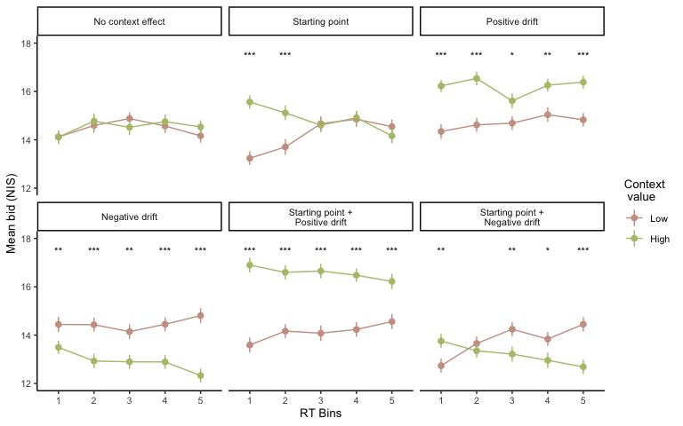

Computational model - Valuation
================

-   Simulated a WTP accumulation model, the Diffusion Model for
    responses on a continuous scale, to understand how context
    influences valuation.

# Description of models

1.  Effect of context on starting point

-   Baseline model: No starting point bias. The starting point is set at
    the origin.

$$
z_i = [0,0]
$$

- Starting point model: The average value of the three products
determines the direction of the starting point.

$$
z_{dir,i} \sim z_0 + z_1WTP_{average,i}
$$

2.  Effect of context on drift

-   Baseline model: Only the value of the target determines the
    direction of the drift.
    
$$
v_{dir,i} \sim v_0 + v_1WTP_{target,i}
$$

-   Drift model: The value of the target product and the context
    products determine the direction of the drift. Positive (positive
    $v_2$) and negative effect (negative $v_2$) of context on drift rate were considered.

$$
v_{dir,i} \sim v_0 + v_1WTP_{target,i} + v_2WTP_{context,i}
$$

3. Models 
- Simulated six variants of the WTP accumulation model. Each model
represented a unique hypothesis on the effect of context on the starting
point and the drift. 
- Examined which of the six models best mimicked
the behavioral data.

# Results

-   Only the starting point model demonstrated the observed relationship
    between the bids and the RT. The starting point model showed a
    positive context effect on the bids only in fast responses. The
    starting point model did not show a positive context effect in slow
    responses.
    
## Observed data 

<!-- -->

## Simulation results 

<!-- -->

-   Details on statistical analysis
    -   Compared the mean WTP at each RT bin with paired t-tests.
    -   RT bin was defined by quantiles (0.2, 0.4, 0.6, 0.8) of each
        trial type’s RT. For example, the first bin included all
        decisions faster than the 0.2 quantile of RT of a trial type,
        the second bin contained decisions faster than the 0.4 quantile
        and slower than the 0.2 quantile of RT of the trial type, etc.

<table>
<caption>
WTP - RT relationship (paired t-tests)
</caption>
<thead>
<tr>
<th style="text-align:left;">
modelName
</th>
<th style="text-align:left;">
rtBin
</th>
<th style="text-align:right;">
statistic
</th>
<th style="text-align:right;">
p
</th>
</tr>
</thead>
<tbody>
<tr>
<td style="text-align:left;">
No context effect
</td>
<td style="text-align:left;">
1
</td>
<td style="text-align:right;">
0.012
</td>
<td style="text-align:right;">
0.990
</td>
</tr>
<tr>
<td style="text-align:left;">
No context effect
</td>
<td style="text-align:left;">
2
</td>
<td style="text-align:right;">
-0.449
</td>
<td style="text-align:right;">
0.654
</td>
</tr>
<tr>
<td style="text-align:left;">
No context effect
</td>
<td style="text-align:left;">
3
</td>
<td style="text-align:right;">
1.019
</td>
<td style="text-align:right;">
0.310
</td>
</tr>
<tr>
<td style="text-align:left;">
No context effect
</td>
<td style="text-align:left;">
4
</td>
<td style="text-align:right;">
-0.493
</td>
<td style="text-align:right;">
0.623
</td>
</tr>
<tr>
<td style="text-align:left;">
No context effect
</td>
<td style="text-align:left;">
5
</td>
<td style="text-align:right;">
-1.084
</td>
<td style="text-align:right;">
0.281
</td>
</tr>
<tr>
<td style="text-align:left;">
Starting point
</td>
<td style="text-align:left;">
1
</td>
<td style="text-align:right;">
-6.693
</td>
<td style="text-align:right;">
0.000
</td>
</tr>
<tr>
<td style="text-align:left;">
Starting point
</td>
<td style="text-align:left;">
2
</td>
<td style="text-align:right;">
-3.527
</td>
<td style="text-align:right;">
0.001
</td>
</tr>
<tr>
<td style="text-align:left;">
Starting point
</td>
<td style="text-align:left;">
3
</td>
<td style="text-align:right;">
0.185
</td>
<td style="text-align:right;">
0.854
</td>
</tr>
<tr>
<td style="text-align:left;">
Starting point
</td>
<td style="text-align:left;">
4
</td>
<td style="text-align:right;">
-0.171
</td>
<td style="text-align:right;">
0.864
</td>
</tr>
<tr>
<td style="text-align:left;">
Starting point
</td>
<td style="text-align:left;">
5
</td>
<td style="text-align:right;">
1.104
</td>
<td style="text-align:right;">
0.272
</td>
</tr>
<tr>
<td style="text-align:left;">
Positive drift
</td>
<td style="text-align:left;">
1
</td>
<td style="text-align:right;">
-4.923
</td>
<td style="text-align:right;">
0.000
</td>
</tr>
<tr>
<td style="text-align:left;">
Positive drift
</td>
<td style="text-align:left;">
2
</td>
<td style="text-align:right;">
-5.414
</td>
<td style="text-align:right;">
0.000
</td>
</tr>
<tr>
<td style="text-align:left;">
Positive drift
</td>
<td style="text-align:left;">
3
</td>
<td style="text-align:right;">
-2.353
</td>
<td style="text-align:right;">
0.020
</td>
</tr>
<tr>
<td style="text-align:left;">
Positive drift
</td>
<td style="text-align:left;">
4
</td>
<td style="text-align:right;">
-3.221
</td>
<td style="text-align:right;">
0.002
</td>
</tr>
<tr>
<td style="text-align:left;">
Positive drift
</td>
<td style="text-align:left;">
5
</td>
<td style="text-align:right;">
-4.760
</td>
<td style="text-align:right;">
0.000
</td>
</tr>
<tr>
<td style="text-align:left;">
Negative drift
</td>
<td style="text-align:left;">
1
</td>
<td style="text-align:right;">
2.654
</td>
<td style="text-align:right;">
0.009
</td>
</tr>
<tr>
<td style="text-align:left;">
Negative drift
</td>
<td style="text-align:left;">
2
</td>
<td style="text-align:right;">
4.362
</td>
<td style="text-align:right;">
0.000
</td>
</tr>
<tr>
<td style="text-align:left;">
Negative drift
</td>
<td style="text-align:left;">
3
</td>
<td style="text-align:right;">
3.294
</td>
<td style="text-align:right;">
0.001
</td>
</tr>
<tr>
<td style="text-align:left;">
Negative drift
</td>
<td style="text-align:left;">
4
</td>
<td style="text-align:right;">
4.372
</td>
<td style="text-align:right;">
0.000
</td>
</tr>
<tr>
<td style="text-align:left;">
Negative drift
</td>
<td style="text-align:left;">
5
</td>
<td style="text-align:right;">
6.696
</td>
<td style="text-align:right;">
0.000
</td>
</tr>
<tr>
<td style="text-align:left;">
Starting point + Positive drift
</td>
<td style="text-align:left;">
1
</td>
<td style="text-align:right;">
-9.007
</td>
<td style="text-align:right;">
0.000
</td>
</tr>
<tr>
<td style="text-align:left;">
Starting point + Positive drift
</td>
<td style="text-align:left;">
2
</td>
<td style="text-align:right;">
-6.653
</td>
<td style="text-align:right;">
0.000
</td>
</tr>
<tr>
<td style="text-align:left;">
Starting point + Positive drift
</td>
<td style="text-align:left;">
3
</td>
<td style="text-align:right;">
-6.608
</td>
<td style="text-align:right;">
0.000
</td>
</tr>
<tr>
<td style="text-align:left;">
Starting point + Positive drift
</td>
<td style="text-align:left;">
4
</td>
<td style="text-align:right;">
-6.156
</td>
<td style="text-align:right;">
0.000
</td>
</tr>
<tr>
<td style="text-align:left;">
Starting point + Positive drift
</td>
<td style="text-align:left;">
5
</td>
<td style="text-align:right;">
-4.859
</td>
<td style="text-align:right;">
0.000
</td>
</tr>
<tr>
<td style="text-align:left;">
Starting point + Negative drift
</td>
<td style="text-align:left;">
1
</td>
<td style="text-align:right;">
-2.980
</td>
<td style="text-align:right;">
0.003
</td>
</tr>
<tr>
<td style="text-align:left;">
Starting point + Negative drift
</td>
<td style="text-align:left;">
2
</td>
<td style="text-align:right;">
0.857
</td>
<td style="text-align:right;">
0.393
</td>
</tr>
<tr>
<td style="text-align:left;">
Starting point + Negative drift
</td>
<td style="text-align:left;">
3
</td>
<td style="text-align:right;">
2.744
</td>
<td style="text-align:right;">
0.007
</td>
</tr>
<tr>
<td style="text-align:left;">
Starting point + Negative drift
</td>
<td style="text-align:left;">
4
</td>
<td style="text-align:right;">
2.217
</td>
<td style="text-align:right;">
0.028
</td>
</tr>
<tr>
<td style="text-align:left;">
Starting point + Negative drift
</td>
<td style="text-align:left;">
5
</td>
<td style="text-align:right;">
4.609
</td>
<td style="text-align:right;">
0.000
</td>
</tr>
</tbody>
</table>
